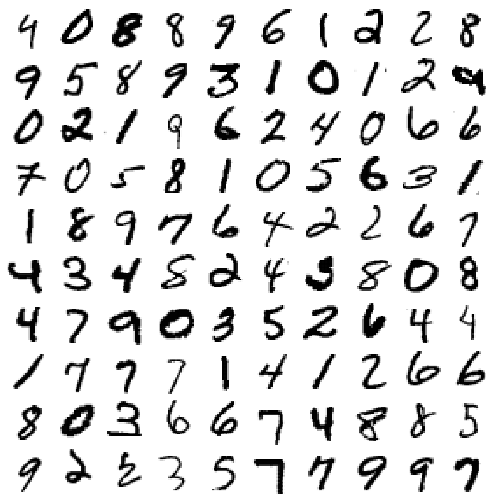

## MNIST Classification Visual Report (Streamlit)

This project turns a classification learning notebook into an interactive Streamlit app with clear visuals and an accompanying report.



### Problem statement
Classify 28×28 grayscale images of handwritten digits (0–9). The focus here is on visual understanding and evaluation concepts rather than heavy training.

### Dataset overview
- Dataset: MNIST (70,000 images, `28×28`, 10 classes)
- Source: OpenML `mnist_784`
- Included visuals: sample digit grid, class distribution, PCA embedding, optional t-SNE

### Methods & architecture
- Streamlit app (`streamlit_app.py`) with modular components in `src/`
- Lightweight, cached dataset loading via `sklearn.datasets.fetch_openml`
- Visualizations using Matplotlib/Seaborn
- Optional non-linear embedding (t-SNE) with configurable perplexity
- Heavy training disabled by default to keep the app responsive

### Results (metrics, visuals)
- Class balance visualization
- PCA 2D scatter colored by class
- Optional t-SNE 2D scatter colored by class
- Confusion matrix and PR/ROC analyses can be added as fast baselines (see Further improvements)

### How to run/deploy
1. Install dependencies:
   ```bash
   pip install -r requirements.txt
   ```
2. (Optional) Generate the README image locally:
   ```bash
   python scripts/generate_readme_image.py
   ```
3. Run the app:
   ```bash
   streamlit run streamlit_app.py
   ```
4. Deploy to Streamlit Community Cloud:
   - Push this repo to GitHub (done in setup below)
   - In Streamlit Cloud, select the repo and set the entrypoint to `streamlit_app.py`

### Screenshots or live demos 
- Add screenshots or the deployed app URL here after deployment.

### Further improvements
- Add a very fast baseline classifier on a small subset (e.g., LogisticRegression), and visualize confusion matrix, precision–recall curve, and ROC curve.
- Persist precomputed embeddings (e.g., via `st.cache_data` export) to speed up initial loads on cloud.
- Explore class-specific clusters in embeddings and nearest-neighbor error analysis.
- Add controls to filter classes or compare subsets (e.g., 3 vs 5).

---

#### Project structure
```
.
├── assets/
│   └── figures/
│       └── sample_grid.png
├── scripts/
│   └── generate_readme_image.py
├── src/
│   ├── data.py
│   └── plots.py
├── streamlit_app.py
├── requirements.txt
└── README.md
```


